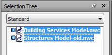

# Comparing Models

We can use Navisworks to compare 2 versions of the same model in order to find out what has changed between model issues. The tool in Navisworks is quite basic but it is a good place to start when you want to know what the main changes are when you receive models from other disciplines. 

To compare models we start in the same way as if we were just [appending models](../../Appending Models/appending-models/) but this time it’s more important that we add the models in the correct order starting with the latest model and then adding the previous model. Once the models have been appended we need to select the models to compare. To do this you open the Selection Tree which can be found in the Home tab and then Select & Search. Once this is open you will see the 2 models listed. You select them both and then from Tools in the Home tab

<a href="../.././img/comparing-models-1.png" target="_blank">
    {: style="height:auto" :target="_blank"}
</a>

<a href="../.././img/comparing-models-2.png" target="_blank">
    {: style="height:auto" :target="_blank"}
</a>

Once you have selected the Compare tool a dialog box appears that allows you to choose how you want the comparison tool to work.

<a href="../.././img/comparing-models-3.png" target="_blank">
    {: style="height:auto" :target="_blank"}
</a>

You can find differences between a few different settings but within Navisworks Geometry is the only setting we really want to choose. This is because the tool is quite basic and highlighting the other settings will make the results unclear. We can also change how the results are shown. 

*	Save as Selection Sets
    *	Saves the items that you are comparing as a selection set. You can then use this set for later comparisons between the same items.
*	Save Each Difference As Set
    *	Saves the resulting differences found in the comparison between the two items as a selection set for later analysis. The selection set will also have a comment attached detailing the differences in more depth.
*	Remove Old Results
    *	Removes any selection sets resulting from a previous comparison, in order to reduce confusion when looking at the results.
*	Hide Matches
    *	Hides all items that turn out to be the same in the comparison, when the comparison finishes.
*	Highlight Results
    *	Highlights each resulting difference with a colour override, when the comparison finishes. You can reset the colours back by clicking Home tab-Project panel-Reset All drop down-Appearance

When the comparison is finished, the results can be highlighted in the Scene View. The following color-coding is used by default:

*	White
    *	Matching items (as Hide Matches is ticked it won’t highlight anything in white)
*	Red
    *	Items with differences.
*	Yellow
    *	The first item contains things not found in the second item.
*	Cyan
    *	The second item contains things not found in the first item.

Top Tip – if the colours of your model don’t change go to Render Style in the Viewpoint tab and change it from Full Render t0 Shaded

 
 
 
 