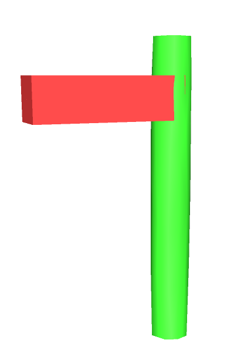
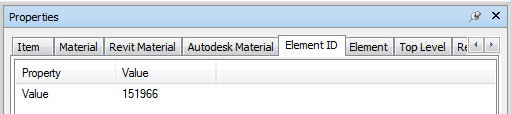
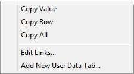
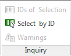
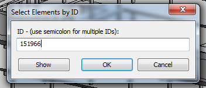
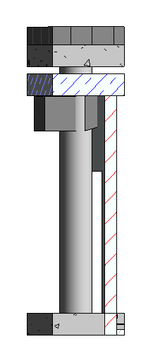

This method is the most basic but it will still allow you to find the element that is clashing. To do this we need to select the element from your discipline model and then going to properties.

<a href="../../.././img/by-id-number-1.png" target="_blank">
    {: style="height:400px" :target="_blank"}
</a><a href="../../.././img/by-id-number-2.png" target="_blank">
    {: style="height:auto" :target="_blank"}
</a>

Once in properties find the tab called Element ID and select. You can now see a number. This is the unique ID that every element in Revit has. This number cannot be seen in Revit but it is there. If you right click on the number you have the choice to copy value, copy row or copy all.

<a href="../../.././img/by-id-number-3.png" target="_blank">
    {: style="height:auto" :target="_blank" .center}
</a>

Select copy value from this option and now you have copied the unique ID number. In Revit got the Manage tab, Inquiry and Select by ID and paste the value and select ok. 

<a href="../../.././img/by-id-number-4.png" target="_blank">
    {: style="height:auto" :target="_blank"}
</a><a href="../.././img/by-id-number-5.png" target="_blank">
    {: style="height:auto" :target="_blank"}
</a>

In Revit the element that you selected in Navisworks is now selected. Now we can either use [Coins Auto Section Box](https://apps.autodesk.com/RVT/en/Detail/Index?id=8920075109543819118&appLang=en&os=Win32_64) or the Revit Section Box tool (new in Revit 2016). This allows you to zoom in locally on the object you have selected.

<a href="../../.././img/by-id-number-6.png" target="_blank">
    {: style="height:auto" :target="_blank" .center}
</a>

This allows you to start correcting the issues found in Navisworks.

 
 
 