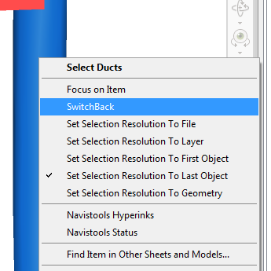

Navisworks switchback does the exact same thing as selecting by ID but it’s an automatic process. 

For Navisworks SwitchBack to work we need to first turn it on in Revit. If you have both Revit and Navisworks Manage installed you will automatically have the option to turn it on. It can be found in Revit by going to the Add-Ins tab. From External Tools you have the option for Navisworks SwitchBack 2016. By selecting it you are turning it on. Unfortunately there is no way of knowing you have turned it on but you can select it as many times as you like, it won’t turn it off. Once you have turned it on you now go back to Navisworks. 

In Navisworks there is two ways of using SwitchBack. Firstly you can right click on the item and choose SwitchBack or if you are selecting the item through Clash Detective then there is a button to press that will do SwitchBack. 

<a href="../../.././img/navisworks-switch-back-1.png" target="_blank">
    {: style="height:auto" :target="_blank"}
</a><a href="../../.././img/navisworks-switch-back-2.png" target="_blank">
    {: style="height:50px" :target="_blank"}
</a>

When using the button from Clash Detective ensure you select the button on the correct size of the results in order for it to recognise the item. 

Both ways do the same thing where it creates a new 3D view called Navisworks SwitchBack and uses a camera view to show exactly the view you have in Navisworks. 

Please note that there is sometimes a graphical issue where the items you have selected for SwitchBack aren’t showing. To resolve this stay in the Navisworks SwitchBack view in Revit and select a view from the view cube. Then go back into Navisworks and re do the SwitchBack. This time the view should be created with all the objects turned on. 

 
 
 