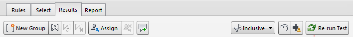

This method allows you to group items by multiple selections. This is a much quicker method than the Group Clashes Involving Item method as you can select everything at a specific level or everything of a specific type. For this example I will be using the selection tree to choose items but the method is the same if you are picking items from the model.

The first thing we do in this method is change the filter type from None to Inclusive.

<a href="../../.././img/grouping-the-clashes-from-items-selected-1.png" target="_blank">
    {: style="height:auto" :target="_blank"}
</a>

<a href="../../.././img/grouping-the-clashes-from-items-selected-2.png" target="_blank">
    {: style="height:auto" :target="_blank"}
</a>

What this option does is only shows you the clashes involving items you have picked either from the model directly or from the selection tree. 

The clash test we are using is still STR-StructuralColumns vs STR-StructuralFraming so from the Selection Tree we need to expand the Structures Model. We can now expand the level we want to group by and then expand Structural Framing. You then get the different families from Revit listed so you can expand this so that you can group the clashes by level and then by family type. 

<a href="../../.././img/grouping-the-clashes-from-items-selected-3.png" target="_blank">
    {: style="height:auto" :target="_blank"}
</a> 
<a href="../../.././img/grouping-the-clashes-from-items-selected-4.png" target="_blank">
    {: style="height:auto" :target="_blank"}
</a> 

Becaue we have the Inclusive filter on the number of clashes shown now only includes those involving the 400 x 800mm at the 02 – Floor level. In the clash results now we can select the first clash shown and then scroll to the bottom and shift+left click to select all the clashes. Right click and select Group. This group now contains all the clashes and it shows them all on the screen. This makes the information much easier to review. 

<a href="../../.././img/grouping-the-clashes-from-items-selected-5.png" target="_blank">
    {: style="height:auto" :target="_blank" .center}
</a>

The group can then be renamed so that it’s easy to review. If you were to do this for all the clashes in this test you would end up with 10 issues. Removing 518 individual clashes. Depending on the number of different elements in the test this can be time consuming but is still quicker than the Group Clashes Involving Item method. 

Any property that exists in Navisworks can be used in this method which means you can be quite generic or quite specific depending on how you want to group the information. 

 
 
 
