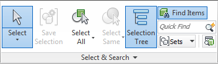
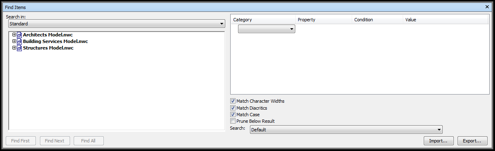
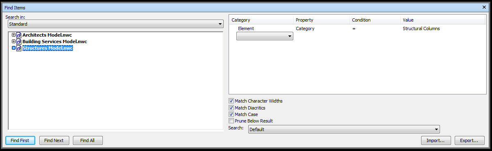

# Grouping the Clash Results

Once we have [carried out the clash detection](../../Creating Clash Tests/creating-clash-tests/) and [published the NWF to an NWD](../../Publishing the Model/NWC to NWD/nwc-to-nwd/) we need to start grouping the results. Before we group the result we should remove the clashes with 0 results. This should only be done if you are working in the NWD and not in the original NWF.

To delete the 0 clashes from the NWD we need to first open Clash Detective from the Home tab. Now we need to run the Compact All tool.

<a href="../.././img/creating-search-sets-1.png" target="_blank">
    {: style="height:auto" :target="_blank" .center}
</a>

This removes all the resolved clashes. Next we need to sort by Clashes. We do this by clicking on the Clashes heading. 

<a href="../.././img/creating-search-sets-2.png" target="_blank">
    {: style="height:auto" :target="_blank" .center}
</a>

Click on it twice so that we have the biggest number at the top. Scroll down the list until the clashes are at 0. Select the first 0 result and then scroll to the bottom of the list. Unfortunately you have to delete each test individually so the depending on how many 0 results there are you are better of using the Delete key on the keyboard. You can hold it down but not be aware that its slightly delayed in updating. When you get closer to the bottom you may want to press delete individually so that you don’t delete results. Now you are eft with only tests that have clashes.

We can group clashes based on levels or based on a components included in the clash. The reason that we do this is because potentially there will be 10,000+ clashes in any model. But that doesn’t mean that there are 10,000+ issues. We need to review the results and understand them so that we can give better feedback to the rest of the team. This can be explained by imagining that we have 1 pipe running down a corridor and it clashes with 30 beams. If the method of resolving this is to move the pipe down or include voids in the beam then that is actually only 1 issue and sorting that will resolve 30 clashes. By grouping the clashes you go from 10,000+ to less than 100 pretty quickly. 

To start grouping the clashes we need to select the clash test that we want to review and then select the Results tab. You will now see all the results for that clash test. For example there might be 528 individual clashes. But this doesn’t really represent the number of issues that there actually are. There are three main ways in which you can group clashes. You can group clashes involving item. You can group by items you select or you can use the Clash Grouper add-in. 

<a href="../.././img/creating-search-sets-3.png" target="_blank">
    {: style="height:auto" :target="_blank" .center}
</a>

In this example we are clashing STR-StructuralColumns vs STR-StructuralFraming. There are currently 528 clashes.

 
 
 