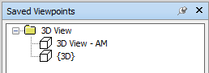
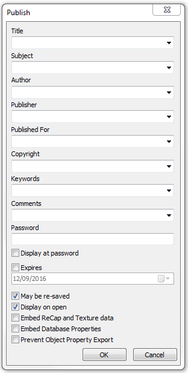

Once you have exported your model from its native software to NWC you need to review it and publish it to NWD. To do this you need to open the NWC file, turn the render style to wire frame, orbit around the model and then turn it back to shaded. The same method we do when we [append models](../../../Appending Models/appending-models/). 

Then we need to clear out any views that have been transferred across as these are not needed. To do this we need to open up the Saved Viewpoints window. This can be opened by going to the View tab and then under Workspace there is a Windows button that drops down. Tick Saved Viewpoints and the window will appear. Typically there will be a folder called 3D Views that has a couple of saved viewpoints in. Select the folder and delete it.

<a href="../../.././img/nwc-to-nwd-1.png" target="_blank">
    {: style="height:auto" :target="_blank" .center}
</a>

Now you need to review the model. This can just be a visual inspection of the model to ensure that everything has transferred across. If it appears that something hasn’t transferred across as you would expect you may want to check your export settings and the 3D view you were in in the native software and make sure that you can see everything before you export it. 

It is also important to ensure that the properties have transferred properly. As in some instances the Navisworks file will be the one that people use to review the information. This can be checked by selecting any object in Navisworks and reviewing the Properties. Properties can be access from the Home tab and then Display. In Properties under the Element tab you should see all the parameters that exist within the native software. 

Once you are happy that Navisworks is showing everything we can now publish this to NWD. To do this you go to the Output tab, and in Publish there is an NWD option. When you select this, the Publish windows come up. This allows you fill in information about the model

<a href="../../.././img/nwc-to-nwd-2.png" target="_blank">
    {: style="height:auto" :target="_blank" .center}
</a>

 
Title – This is the project name 
Subject – This is the name of the building (if different to the project name) 
Author – This is the name of the BIM Coordinator 
Publisher – This is Your Company 
Published For – This is the purpose of the NWD 
Copyright – TBC 
Keywords – N/A 
Comments – N/A 
Password – N/A 
Display at password – Leave unticked 
Expires – Leave unticked 
May be re-saved – Ticked as it means if someone links the NWD into a NWF they can save it 
Display on open – Ticked. This refers to this box of information 
Embed ReCap and Texture data – Leave unticked unless you have point cloud data 
Embed Database Properties – Leave unticked unless you have linked a database 
Prevent Object Property Export – Leave unticked 

Once you have filled this in select OK and it will then ask you to save the model somewhere. Give it an appropriate name and you now have an NWD.

 
 
 
