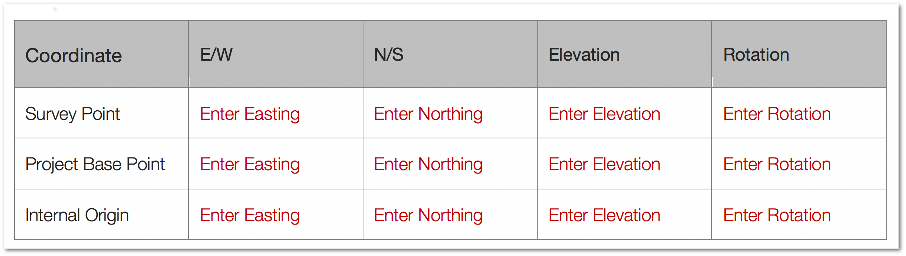
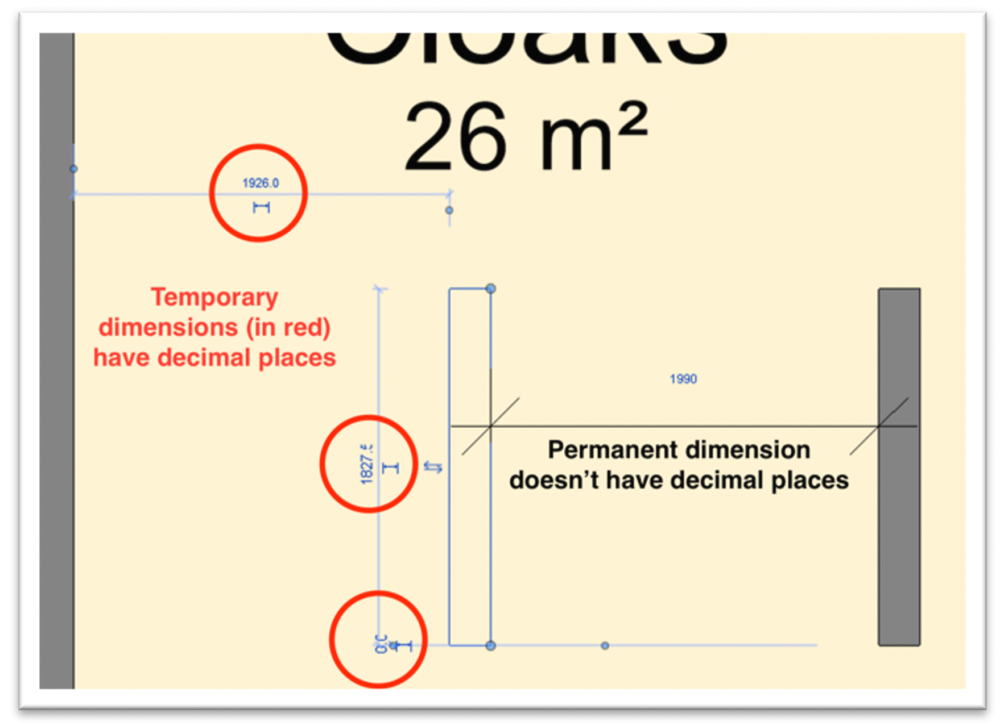
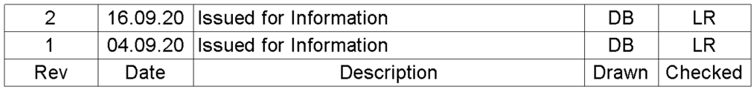

# Project Setup

---

## Project Template

Where a new project is created in Revit the most up to date version of the ‘Architype Template’ shall be used. This no longer requires users to locate the template on the server, instead, simply open Revit, go to ‘File’ ‘New’ – and select ‘Architype Template’. 

<a href=".././img/project-template.png" target="_blank">
    {: style="height:200px" :target="_blank"}
</a>

Architype’s Revit Template is a read-only document and must not be edited by any member of staff.

The template contains preloaded Detail Items, Filled Regions, View Templates, Worksets and Basic Wall/Floor/Roof Types. It also contains predefined Text Types, Line Styles and Browser Organisation. This is done to speed up the process of starting a new project and ensures that there are examples of correct naming within the project. 

The template will be regularly updated to ensure compliance with current BS EN ISO Standards. If a high standard view template, detail component etc, has been created which works well and may be of value to others, then contact one of Architype’s Information Management team to have it inserted into the next revision of the template. 

---
## Coordinate system
All Revit models shall use a consistent and uniform coordinate system throughout the project’s lifecycle to ensure information is always precisely aligned. 

Shared coordinates should **only** be acquired from a **separate site model** i.e. a geolocated site model should be created from a survey to share with all other disciplines. The main building is then modelled in a separate Revit file. This will make it easier for other consultants to acquire coordinates, it is also easier if the building needs to move.

!!! Attention
    **It is important that this part of the project is carried out correctly as it can have a lasting effect on a project if done incorrectly. This should **only** be done by a member of the BIM managment team.**

### Survey Point
The survey point identifies a real-world location near the model, such as a corner of the project site or the intersection of 2 property lines. It defines the origin of the survey coordinate system, which provides a real-world context for the model. 

### Project Base Point
The project base point defines the origin (0,0,0) of the project coordinate system, used as a reference point for measurements across the site. Where there are gridlines in a project, the preference is to place the Project Base Point at the intersection of grid A-1. 

### Internal Origin (or Start-up Location):
The internal origin is the starting point for the internal coordinate system, which provides the basis for positioning all elements in the model. The location of the internal origin never moves. It’s the origin from which the survey point (and real-world context) and project base point are established. 

<a href=".././img/project-base-point.png" target="_blank">
    {: style="height:200px" :target="_blank"}
</a>

The following table is included within Architype’s standard BIM Execution Plan (BEP) – and, where we are employed as BIM Manager, this will need to be filled in by the project team at the start of the project. 

<a href=".././img/coordination-table.png" target="_blank">
    {: style="height:150px" :target="_blank"}
</a>

---

## Project Units
It is important to use consistent units and measurement across the project. 

Default project units shall be as set out in the table below:

| Type                 | Symbol | Units                                                                                             | Accuracy (Decimal Places)           |
| ---------------------| -------|---------------------------------------------------------------------------------------------------|------------------------------------ |
| Length               | mm     | Milimeters                                                                                        | 0 |
| Area                 | m2    | Square Meters                                                                                     | 0 |
| Volume               | m3    | Cubic Meters                                                                                      | 0 |
| Weight               | Kg     | kilogram                                                                                          | 0 |
| Cost                 | £      | Pound Sterling                                                                                    | 0 |
| Spatial Coordinates  | m      | Meters (based on the UK Ordnance Survey National Grid Easting’s and Northing’s co-ordinate system)| 3 |
| Datum                | m      | Meters (based on the UK Ordnance Survey National Datum)                                           | 3 |

!!! Attention
    **Note: temporary dimensions (such as the below screenshot) will display with decimal places.**

<a href=".././img/project-units.png" target="_blank">
    {: style="height:350px" :target="_blank"}
</a>

---

## Setting up the Project Browser

### Sheets
Sheets should be organised in Revit through their numbering, sorting them into View Group & Sub View Group. For more information on numbering, see  ['Number'](file-naming.md) in 'File Naming'

-	**‘View Group’**: indicates the series number 
-	**‘Sub View Group’**: indicates the sub series number

These can be found, and edited, in the properties bar of a selected sheet or view. 
 
In order to set up this organisation at the start of a project, follow the steps set out below: 

<a href=".././img/project-browser-sheets.png" target="_blank">
    {: style="height:275px" :target="_blank"}
</a>

### Views
Revit views are categorised into:

- **01 Working** (day-to-day working views)
- **02 Drawing Set** (views which are on sheets)
- **03 Presentation** (views to be taken into other pieces of software for presentation)
- **04 Coordination** (views to assist with coordination, i.e. overlaying imported models)

!!! Tip
    **Within *'01 Working'* category you can put your initials at the end of the view name to let other team members know you are working on this particular view. When you are done or no longer need the view it should be deleted.**

To ensure that the project browser stays as organised as possible, views from the ‘02 Drawing Set’ should be placed on sheets as soon as possible. Once they are on sheets they will be automatically removed from the browser and accessed only through the sheets. This keeps the project browser tidy and makes sure that drawings are always developed in the context of a sheet. 

Although this process is incorporated into the Architype Template, for those working in projects already set up on previous templates, the process below can be followed. 

<a href=".././img/project-browser-views.png" target="_blank">
    {: style="height:250px" :target="_blank"}
</a>

---

## Creating a Cloud Model

The majority of project Revit models will be stored on BIM360, certainly any project with more than one person needing access. Where this is the case, a cloud model must be created. 

Firstly the model is created on the Architype server, using the correct template, units and coordinates as above. It should be named correctly in accordance with ['File Naming'](file-naming.md)

Secondly, the job will be set up as a project on BIM360 (this will be done by one of Architype’s BIM360 admins – contact them through the Architype *#revithowdoidothat* Slack Channel in plenty of time). The folders outlined in ['Folder Structure'](folder-structure.md) will need to be created - this can be done manually in BIM360, or the folders can be copied from an empty folder structure template onto BIM360 through As described in ['Desktop Connector'](folder-structure.md#desktopconnector) to save time. 

Once all of this is in place, the model should be pushed to the cloud using the ‘collaborate’ tab as shown below. 

<a href=".././img/create-cloud-model.png" target="_blank">
    {: style="height:425px" :target="_blank"}
</a>

Click <a href="https://knowledge.autodesk.com/support/revit-products/learn-explore/caas/CloudHelp/cloudhelp/2020/ENU/Revit-Cloud/files/GUID-B7FF1E32-C719-4407-B349-3F7FDAAAF4EF-htm.html" target="_blank">here</a>
for more information on creating a cloud model from the Autodesk Knowledge Network.

---

## Project Information

### Starting View

The template file contains a ‘Starting View’. This is the view which holds key project information and opens up first when you open Revit. Once in Revit, it can be found within Legends in the Project Browser.

<a href=".././img/template-starting-view.png" target="_blank">
    {: style="height:500px" :target="_blank"}
</a>

The following information must be filled in at the beginning of the project: 

**‘PROJECT INFORMATION’**
-	Number, Name, Client, User Client, Employer/Client (D&B)

**‘KEY PROJECT DATA’**
-	Ground Floor FFL

**‘FILE INFORMATION’**
-	‘File Created by’ should be your company email address.
-	‘Revit version’: To find out this, go to the small down arrow beside the help button at the top right of the screen – then to *‘About Autodesk Revit’*, this will open up a window containing the information relating to the version you are working in. 

!!! Example
    Add typical example of te output for tis location here

### Manage
While filling in the required information on the Starting View, the Project Location and Project Information should also be filled in. These can both be found under the ‘Manage’ tab. 

### Project Location: 
‘Manage’ tab – ‘Project Location’ category – ‘Location’ button. The address of the site should be entered here.

<a href=".././img/project-location.png" target="_blank">
    {: style="height:250px" :target="_blank"}
</a>

### Project Information:
‘Manage’ tab – ‘Settings’ category – ‘Project Information’ button. 

Enter all known project information here.

<a href=".././img/project-information.png" target="_blank">
    {: style="height:400px" :target="_blank"}
</a>

---

## Worksets

A workset is a collection of elements in a model. They are useful to help organise elements so members of a team can choose to display and work on selected worksets.

They can be found by clicking on this icon  at the bottom of the Revit window.  

Typically, a project is expected to include the following worksets which are set up within the Architype Revit Template

!!! Tip
    There will also be the Revit default *‘Workset1’* and *‘Shared Levels and Grids’* workset. These shall be kept intact. Shared Levels and Grids shall contain all Levels and Grids elements to allow for easy maintenance across the board. 

In order to set up new Worksets either click on the worksets icon at the bottom of the screen, or access via the ‘Collaborate’ tab – ‘Manage Collaboration’ – ‘Worksets’.

In the Worksets dialogue click ‘New’ and enter a name (worksets must be named in accordance with protocol outlined in ['Component Naming'](component-naming.md#worksets) . 

To display the workset in all project views as default select ‘Visible in all views’. Clear this option if you want the workset to display only in views where you specifically turn on its visibility. 

---

##  Copy/Monitor Strategy for Datum Elements

When collaborating on a project with other teams, use the Copy/Monitor tool to monitor and coordinate changes to important elements of the design. Use the Copy/Monitor tool when the following statements are true: 

- The architectural team, the structural team, and the engineering team use Revit software. 
- Each team must be informed of changes to levels, grids, and other elements. 
- The teams will link models to work on the same building design. Each team maintains its own edition of the model and uses Revit software to develop the design for their discipline. Each model is linked to the other models to share information about changes to monitored elements in the building design. 

This will allow the other teams to control the graphical representation of datum elements within their model while maintaining correct relationship. Also, any changes to Levels and Grids in the parent model which the levels were copied from will create a warning in the model which they were copied to. Creating a single point of truth, eliminating possible errors.  

Under the ‘Collaborate’ tab there is a ‘Copy/Monitor’ button, select this then ‘Select Link’ and click on the link you wish to copy/monitor levels from. A new options bar will appear, select ‘Copy’, tick ‘Multiple’ then click on to the levels. Note that you must select the small finish button after clicking on each level, when that’s done select the large finish button to end the process. 

<a href=".././img/copy-monitor.png">
    {: style="height:150px"}
</a>

Click <a href="https://knowledge.autodesk.com/support/revit-products/learn-explore/caas/CloudHelp/cloudhelp/2020/ENU/Revit-Collaborate/files/GUID-BC9433C7-DC3A-4F73-A905-2CF6DB7DC09E-htm.html" target="_blank">here</a>
for more information on creating a cloud model from the Autodesk Knowledge Network.

## Adding Sheet Revisions

All drawings which are issued from Revit will require a revision (the first time a drawing is issued it will go out as Rev 01). Nothing will ever be issued as Rev – or Rev 0. For more information refer to Section 4.
To add a revision to the project, go to the ‘View Tab’ – the ‘Sheet Composition’ panel – then click ‘Revisions’. Add a revision and fill in all the required information:

<a href=".././img/sheet-issues-revisions.png" target="_blank">
    {: style="height:400px" :target="_blank"}
</a>

**Date:** enter the date on which the drawing will be issued

**Description:** enter the description of the revision. This will show in the revision schedule on the sheet. 

**Issued to:** this will read as ‘Checked’ on the sheet revision schedule. The initials of the person who checked the drawing should be entered here.

**Issued by:** this will read as ‘Drawn’ on the sheet revision schedule. The initials of the person who did the drawing, or made the revision, should be entered here.

To enter a revision onto a sheet, go to the properties of the sheet and select the ‘Edit’ button beside options. This will allow you to tick the revisions you want to add to the sheet. 

<a href=".././img/issued-by.png" target="_blank">
    {: style="height:80px" :target="_blank"}
</a>

This is how they will appear in the Titleblock:

<a href=".././img/title-block-revisions.png" target="_blank">
    {: style="height:80px" :target="_blank"}
</a>
